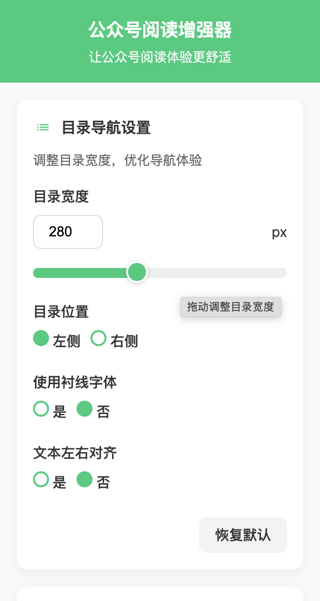

# 插件配置

## 基本配置

{width=250px height=100px}

- 支持设置目录宽度，实时生效
- 支持设置目录展示位置，目录在左时，文章二维码在右，目录在右时，相应调整
- 支持设置使用衬线字体
- 支持设置文本左右对齐

## API Key

{width=250px height=100px}

- 支持设置服务类型：DeepSeek、OpenAI、通义千问
- 支持选择模型类型