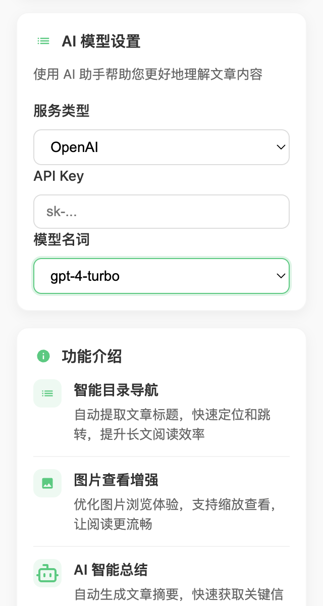

# Plugin Configuration

## Basic Configuration

{width=250px height=100px}

- Supports setting the directory width, takes effect in real time
- Supports setting the directory display position; when the directory is on the left, the article QR code is on the right, and vice versa
- Supports using serif fonts
- Supports setting text alignment (left and right)

## API Key

{width=250px height=100px}

- Supports setting service type: DeepSeek, OpenAI, Tongyi Qianwen
- Supports selecting