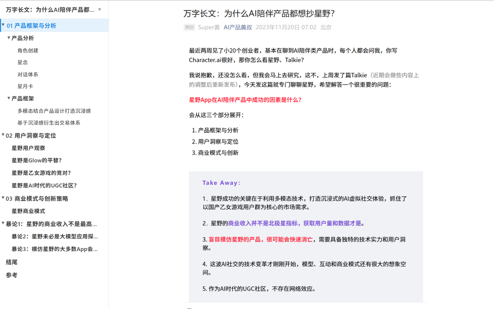

---
# https://vitepress.dev/reference/default-theme-home-page
layout: home

hero:
  name: "WeChat Article Reader Enhancer"
  text: "Make reading WeChat articles more comfortable"
  tagline: Automatically generate article outlines, optimize image viewing, never get lost in long articles, and enhance your reading experience.
  image:
    src: /logo.svg
  actions:
    - theme: brand
      text: Features
      link: /product-requirements
    - theme: alt
      text: Github
      link: https://github.com/honwhy/WeChatReaderEnhancer

features:
  - icon:
      src: /f1.svg
    title: Smart Table of Contents
    details: Automatically extract article headings and generate a structured outline, making long articles easier to navigate. Click any item to jump to the corresponding section instantly.
  - icon:
      src: /f2.svg
    title: Enhanced Image Viewer
    details: Click any image in the article to enlarge and view it in high definition. No more struggling with small images—easily browse charts, diagrams, and beautiful pictures.
  - icon:
      src: /f3.svg
    title: Reading Position Tracking
    details: As you scroll, the outline automatically highlights your current position, so you always know where you are in the article. Reviewing content is also more convenient.
---

## Demo

{width=576px height=360px}
{width=576px height=360px}

## Install Now

- [Chrome](https://chromewebstore.google.com/detail/mbamjfdjbcdgpopfnkkmlohadbbnplhm)
- [Edge](https://microsoftedge.microsoft.com/addons/detail/gfgjnlogfjofmcphfddnanfjlhedfcfh)
- [Firefox](https://addons.mozilla.org/en-US/firefox/addon/%E5%85%AC%E4%BC%97%E5%8F%B7%E9%98%85%E8%AF%BB%E5%A2%9E%E5%BC%BA%E5%99%A8/)