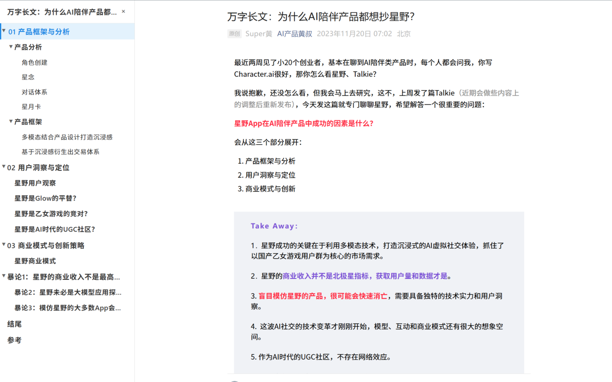
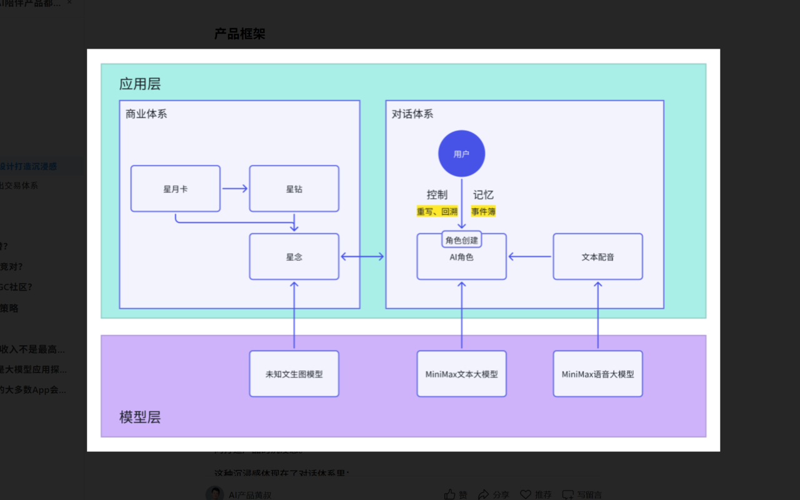

---
# https://vitepress.dev/reference/default-theme-home-page
layout: home

hero:
  name: "公众号阅读增强器"
  text: "让微信公众号阅读体验更舒适"
  tagline: 自动生成文章目录，优化图片查看，让阅读长文不再迷失，提升浏览体验。
  image:
    src: /logo.svg
  actions:
    - theme: brand
      text: 功能介绍
      link: /markdown-examples
    - theme: alt
      text: Github
      link: https://github.com/honwhy/WeChatReaderEnhancer

features:
  - icon:
      src: /f1.svg
    title: 智能目录导航
    details: 自动提取文章标题，生成结构化目录，让长文阅读更有条理，随时掌握文章脉络。点击目录项，立即跳转到对应位置。
  - icon:
      src: /f2.svg
    title: 图片查看增强
    details: 点击文章中的任意图片，即可放大查看，享受高清细节。不再为公众号图片太小而苦恼，轻松浏览图表、图解和精美图片。
  - icon:
      src: /f3.svg
    title: 阅读位置追踪
    details: 滚动阅读时，目录会自动高亮当前位置，让你时刻知道阅读到哪里，不再迷失在长文之中。回看内容也更加便捷。
---

## 效果展示

## 立即安装

- [Chrome](https://honwhy.wang/projects)
- [Edge](https://honwhy.wang/projects)
- [Firefox](https://addons.mozilla.org/en-US/firefox/addon/%E5%85%AC%E4%BC%97%E5%8F%B7%E9%98%85%E8%AF%BB%E5%A2%9E%E5%BC%BA%E5%99%A8/)
